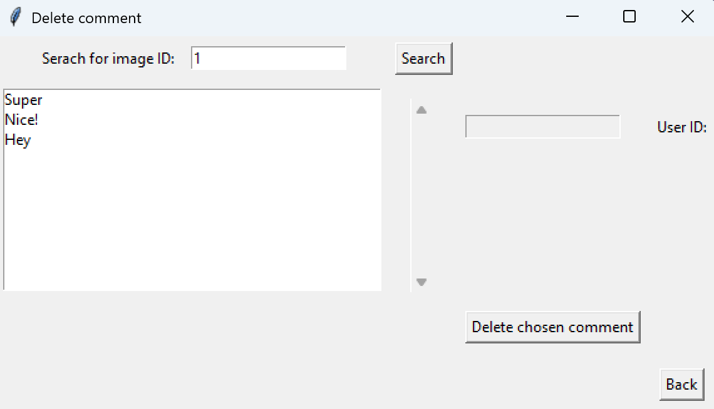
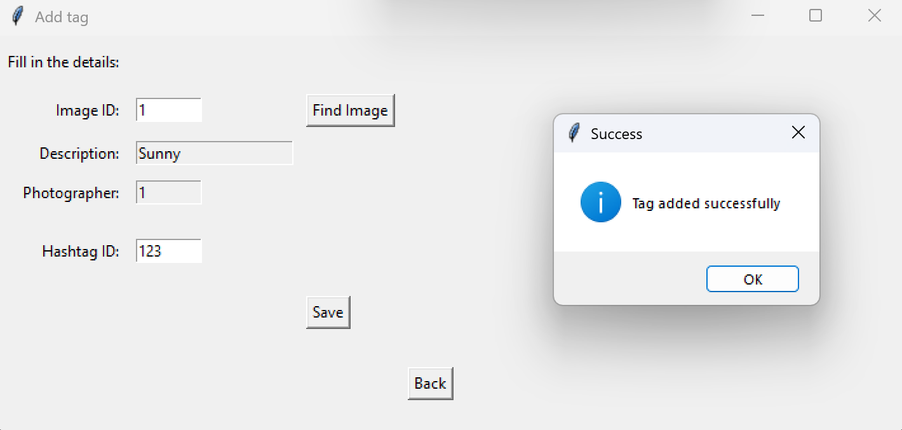

# Photo Application
This is a Python-based desktop application for managing users, photos, comments, likes hashtags, and tags. The app uses Tkinter for the GUI and a relational database (MySQL) in the backend.

## Tech Stack
- Python
- Tkinter
- MySQL

## Features
### User Management
- Add users
- Edit information from a user

### Photo Management
- Add, update and delete photos
- View photo details (description, photographer)

### Comment Management
- Add and delete comments
- List of comments for an user
- List of comments for an image 

### Likes Management
- Add like from users on photos
- Remove likes

### Hashtag Management
- Add and remove hashtags
- Tag photos with hashtags

### Tag Management
- Add and delete tags 

## Project Structure
photo_app/
│
├── gui/                    # GUI classes (Tkinter)
│   ├── bilde_gui.py        # Photo management   
│   ├── bruker_gui.py       # User management     
│   ├── emneknagg_gui.py    # Hashtag management 
│   ├── kommentar_gui.py    # Comment management    
│   ├── like_gui.py         # Likes management 
│   └── tagForImage_gui.py  # Tag photos with hashtags    
│
├── service/                # Business logic
│   ├── bilde_service.py
│   ├── bruker_service.py
│   ├── kommentar_service.py
│   ├── hashtag_service.py
│   ├── like_service.py
│   └── tagForImage_service.py
│
├── database/               # Database connection
│   └── database.py
│
├── main.py                 # Entry point
└── README.md               # Documentation

## Installation
###  Requirements
- Python 
- Dependencies:
```bash
pip install mysql-connector-python
```

### Database Setup
1. Create a MySQL database.
2. Run the provided SQL scripts to create the tables:
    - Bilde
    - Bruker
    - Likes
    - Kommentar
    - Emneknagg (Hashtag)
    - TagForBilde (TagForImage)
3. Configure the connection in database.py:
```bash
self.connection = mysql.connector.connect(
    host="localhost"
    user="your_username"
    password="your_password"
    database="photo_db"
)
```

### Running the Application
From the project root:
```bash
python main.py
```
This will open the main GUI window where you can navigate between the features. 

### Example Workflow
1. Add a new photo in Photo GUI.
2. Link a hashtag to the photo in TagForImage GUI.
3. Like the photo in Like GUI

## Screenshots
Below are some screenshots showing the main features of the application.

### Main Menu
Main menu where the user can navigate between different features. 


### User
User menu where the user can choose between add and edit user.


#### Add User
1. Enter user id, name and email to add an user.

2. If user id already exists an error message shows up.

3. A messagebox "user added successfully" when a user is added


#### Update Email For User
1. Enter id to find user. If successful name and email shows up in the readonly field. 

2. Write a new email. If successful an showinfo messagebox appears. 


### Image
Image menu where the user can choose between add, edit and delete image. 


#### Add Image
1. Fill in all fields to add an image

2. Messagebox shows up when an image has been added. 

3. If image id already exists it will cause an error.

3. If photographer (foreign key to user id) does not exist it will cause error. 


#### Update description on an image
1. Enter image id to get description and date.

2. Enter the new description for the image. A success messagebox appears.


#### Delete an image
1. Image successfully deleted

2. Error when the image id does not exist.


### Likes
Likes menu for add and delete likes.


#### Add Like
1. Like added. 

2. Error if a like already exists. 


#### Delete Like
1. Like successfully deleted

2. Error if image id or user id does not exist. 


### Comments
Comment menu where user can add, delete and get an overview over comments.


#### Add Comment
1. Enter user id to get image-description and date.

2. Comment added successfully. 


#### Delete Comment
1. Enter image id to get comments on the image.

2. Choose which comment should be deleted and user id appears. 

3. Comment successfully deleted 


#### Comments per Image
1. Enter user id to get comments

2. Choose one comment to get information about the user.

#### Comments Overview
1. Enter user id and the user gets all the images for the given user.

2. If the user chooses an image-description, a popup window appears with all the comments of a image. 


### Hashtags
Hashtag menu where the user can add hashtag. 


#### Add Hashtag
1. Hashtag successfully added.

2. Error if the hashtag already exists. 


### Tags
Tag menu where the user can add and delete tags.


#### Add tag
1. Enter image id to get information about the image.

2. Enter hashtag id to add hashtag.

3. Error if hashtag already exists. 


#### Delete tag
Enter image id and the hashtag to delete a hashtag. 


## Future Improvements
There are several areas where the application can be further develop:

- **Improved user experience** - make the GUI more intuitive and user-friendly. 
- **Auto generated IDs** - implement automatic ID generation for primary keys instead of manual entry.
- **Better error handling** - provide more detailed and user-friendly error messages.
- **Database enhancements** - extend the schema to support more advamdes features and relationships.

## Summary
This project demonstrates how a Python desktop application can integrate a graphical user interface (GUI) with a relational database backend. The application covers a wide range of functionality, including user management, photos, comments, likes, hashtags, and tags. It follows a layered structure with clear separation between the GUI (Tkinter), business logic (services), and database access, making the project easier to maintain and extend.  

## Highlights
One part of this project that I am particularly proud of is how the database and application logic have been connected:  

- **SQL setup and relationships** – the database schema is carefully designed with primary/foreign keys to ensure proper relationships between tables.   
- **Business logic layer** – services handle validation and interaction between the GUI and database, ensuring clean separation of concerns.  
- **GUI integration** – Tkinter interfaces are directly connected to the business logic, making it possible to manage data in a user-friendly way while maintaining the backend.  
